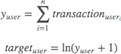
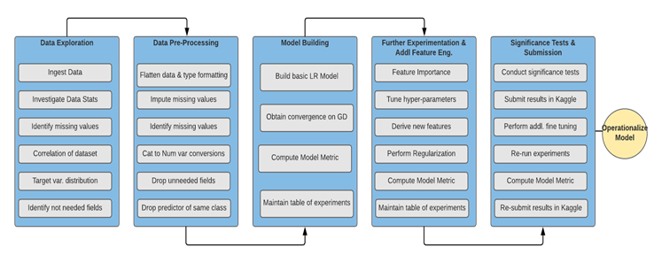

# Online Store Customer Revenue Prediction

Balaji Dhamodharan, bdhamodh@iu.edu, fa20-523-337
Anantha Janakiraman, ajanakir@iu.edu, fa20-523-337

[Edit](https://github.com/cybertraining-dsc/fa20-523-337/edit/master/project/project.md)

{}

## Abstract
The 80/20 rule has proven true for many businesses–only a small percentage of customers produce most of the revenue. As such, marketing teams are challenged to make appropriate investments in promotional strategies. We're challenged to analyze a Google Merchandise Store (also known as GStore, where Google swag is sold) customer dataset to predict revenue per customer. Hopefully, the outcome will be more actionable operational changes and a better use of marketing budgets for those companies who choose to use data analysis on top of GA data.

Contents

{}

{}

**Keywords:** ecommerce,  regression analysis, big data

## 1. Introduction

Our objective is to predict the natural log of total revenue per customer which is a real valued continuous output and linear regression would be an ideal algorithm in such a setting to predict the response variable that is continuous using a set of predictor variables given the basic assumption that there is a linear relationship between the predictor and response variables.

## 2. Datasets

The dataset for this project is obtained from Kaggle. The link to the dataset is provided below:
https://www.kaggle.com/c/ga-customer-revenue-prediction
+	Dataset Explanation:
	+	Two datasets are provided (train.csv and test.csv)
	+	Train.csv  User transactions from August 1st, 2016 to August 1st, 2017
	+	Test.csv   User transactions from August 2nd, 2017 to April 30th, 2018

+	The training dataset contains 872214 records and considering the size of the training dataset, we will plan to use mini-batch or stochastic gradient descent methods to obtain optimized estimates of the coefficients for our linear function that best describes the input variables. After cleaning and pre-processing the data, we will build a basic linear regression model using basic parameter setting and based on outcome of this initial model, we will perform further experimentation to tune the hyper-parameters including regularization and additional feature engineering to derive more features from the provided input data to improve the parameter estimates for our model and reduce the error.

## 3. Metrics

The metrics we will use for this project is root mean squared error (RMSE). The root mean squared error function forms our objective/cost function which will be minimized to estimate the optimal parameters for our linear function through Gradient Descent. We will conduct multiple experiments to obtain convergence using different “number of iterations” value and other hyper-parameters (e.g. learning rate).

RMSE is defined as:

where y-hat is the natural log of the predicted revenue for a customer and y is the natural log of the actual summed revenue value plus one as seen below.

## 4. Methodology

The  high-level representation of the implementation steps is shown below. The below steps are subject to change as we understand more about the data and various pre-processing, feature engineering or model development steps may vary accordingly. 

+	Data Exploration
+	Data Pre-Processing
+	Feature Engineering
+	Build the data pipeline
+	Build Models - Linear Regression Model
+	Build Models - Random Forest Regressor
+	Build Models - XGBoost Regressor
+	Build Models - XGBoost Regressor
+	Build Models - LightGBM Regressor
+	Build Models - Lasso Regression
+	Build Models - Ridge Regressor
+	Build Models - Keras Deep Learning Model
+	Feature Importance
	+	Random Forest Regressor
	+	Xgboost Regressor
	+	LightGBM Regressor
	+	Lasso Regressor Regressor
	+	Ridge Regressor
+	Significance Test
+	Results Validation
+	Summary

## 5. Technologies
+ 	Python
+	Jupyter Notebook (Google Colab)
+ 	Packages: Pandas, Numpy, Matplotlib, sklearn

## 6. References

1. https://www.kaggle.com/c/ga-customer-revenue-prediction/rules
2. https://www.kaggle.com/sudalairajkumar/simple-exploration-baseline-ga-customer-revenue

